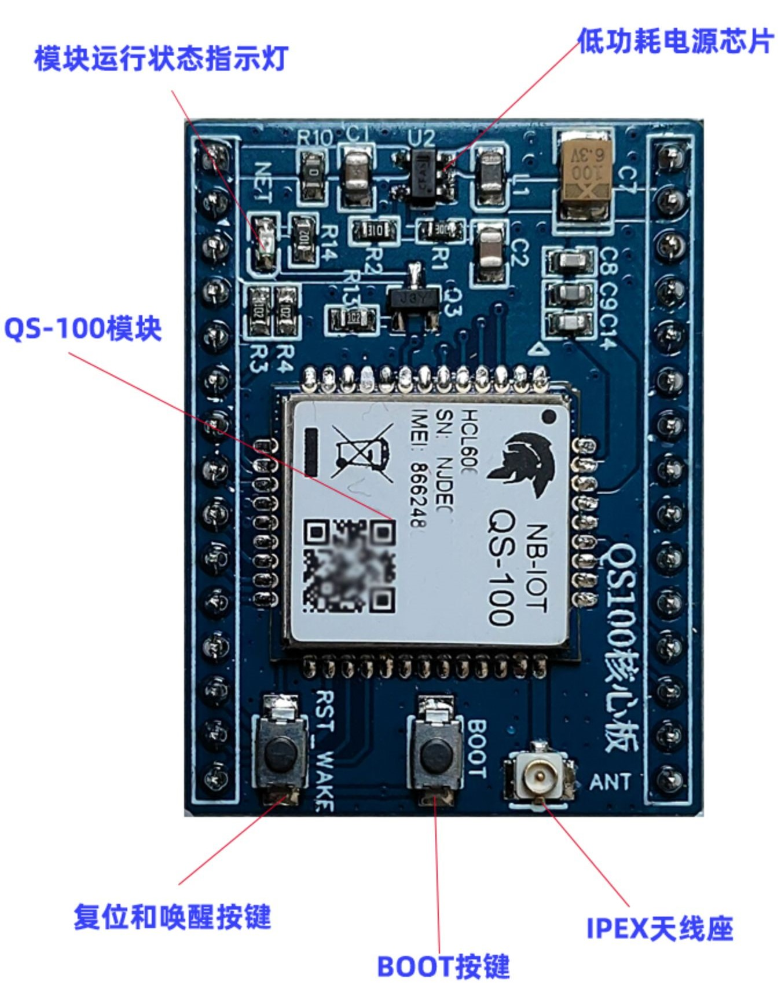

# [XY1100](https://github.com/SoCXin/XY1100)

* [xinyisemi](http://www.xinyisemi.com)：[Cortex-M3](https://github.com/SoCXin/Cortex)
* [L5R5](https://github.com/SoCXin/Level)：39.168MHz, [130MIPS](https://www.eembc.org/coremark/scores.php)

## [简介](https://github.com/SoCXin/XY1100/wiki)

[XY1100](https://github.com/SoCXin/XY1100) 首款集成CMOS PA的NB-IoT系统单芯片

<!--  -->

#### 关键特性

* 灵敏度：< -134 dBm
* 输出功率：23 dBm ± 2 dB
* 690-960MHz，1.71-2.2GHz
* 900K RAM (140K)

### [资源收录](https://github.com/SoCXin)

* [参考资源](src/)
* [参考文档](docs/)
* [参考工程](project/)

### [选型建议](https://github.com/SoCXin)

[XY1100](https://github.com/SoCXin/XY1100) 具有竞争力的双核NB-IoT芯片，高性价比openCPU设计。

* QFN52(6x6mm)

#### 相关开发板

### [探索芯世界 www.SoC.xin](http://www.SoC.Xin)
